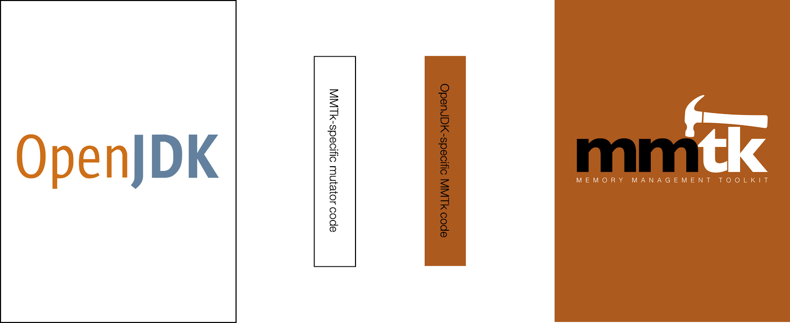

# Porting Guide
> Note: This guide is work in progress.

This guide is designed to get you started on porting MMTk to a new runtime. We start with an overview of the MMTk approach to porting and then step through recommended strategies for implementing a port.

There’s no fixed way to implement a new port.   What we outline here is a distillation of best practices that have emerged from community as it has worked through six ports (JikesRVM, OpenJDK, V8, Mu, Ruby, and .NET, which are at various levels of maturity).

## Overview of MMTk’s Approach to Portability

MMTk is designed from the outset to be both high performance and portable.  The core of MMTk is entirely runtime-neutral, and is written in Rust.   Runtimes that wish to use MMTk may be written in any language so long as they have a means to call into MMTk’s API, which presents itself as a shared library.  

MMTk uses the concept of *bindings* to create high performance impedance matching between runtimes and MMTk.

MMTk’s approach to portability follows these principles:
 1. The MMTk core must remain entirely runtime-agnostic and free of any runtime-specific code.
 2. The runtime’s code base should be entirely garbage-collector agnostic and free of any MMTk-specific code.
 3. The semantics of all MMTk functionality is strictly defined within the MMTk core.

Those principles have the following important implications:
 - Each port of a runtime is supported by a binding that has two components: one which is a logical extension of the runtime, written in the same language as the runtime, but which is MMTk-specific, and one which is a logical extension of MMTk, written in Rust, but which is runtime-specific (see diagram below).
 - A fully-correct but non-performant port will simply implement calls from the runtime to MMTk (to allocate an object, for example), and from MMTk to the runtime (to enumerate pointers, for example).
 - A performant port will likely replicate and lift MMTk functionality into the runtime portion of the port, and conversely replicate runtime functionality in Rust for performant access by MMTk.

The diagram above illustrates a port of MMTk to OpenJDK with the binding in the center.    The code colored brown is logically part of MMTk and is written in Rust.   The code colored white is logically part of OpenJDK and is written in C++.   The rightmost box is entirely free of any OpenJDK-specific code.   The leftmost box should be entirely free of any MMTk-specific code.

> Note: we do currently maintain a fork of OpenJDK which includes some necessary changes to their code base, but this is not MMTk-specific and ideally this will be upstreamed.  Our port to V8 is a cleaner example, where we’ve managed to work closely with the V8 team to upstream all of the refactoring of the V8 code base that was necessary for it to support a third party heap.

We structure the code into three repos.  The [MMTk core](https://github.com/mmtk/mmtk-core), the [binding repo](https://github.com/mmtk/mmtk-openjdk) containing both parts of the binding, and the OpenJDK repo, which is currently [a fork](https://github.com/mmtk/openjdk) we maintain.

## How to Undertake a Port
We recommend a highly incremental approach to implementing a port.   The broad idea is:
 - Start with the NoGC plan and gradually move to more advanced collectors
 - Focus on simplicity and correctness.
 - Optimize the port later.

In MMTk’s language, a plan is essentially a configuration which specifies a GC algorithm.   Plans can be selected at run time.   Not all plans will be suitable for all runtimes.   For example, a runtime that for some reason cannot support object movement won’t be able to use plans that use copying garbage collection.

### NoGC
We always start a port with NoGC.  It is the simplest possible plan, simply allocates memory and never collects it.   Although this appears trivial, depending on the complexity of the runtime and how well factored (or not) its internal GC interfaces are, just getting this working may be a major undertaking.   In the case of V8, the refactoring within V8 required to get a simple NoGC plan working was substantial, touching over 100 files.   So it’s a good idea not to underestimate the difficulty of a NoGC port!

In order to implement NoGC, we only need to handle MMTk initialisation (`gc_init`), mutator initialisation (`bind_mutator`), and memory allocation (`alloc`).

You may want to take the following steps.
 
1. Set up the binding repository/directory structure:
    - `/mmtk` - the MMTk side of the binding. To start, this can be an almost direct copy of the [Dummy VM binding](https://github.com/mmtk/mmtk-core/tree/master/vmbindings/dummyvm).
    - `/vm` (rename this to your VM name) - VM-specific code for integrating with MMTk. This should act as a bridge between the generic GC interface offered by the VM and the MMTk side of the binding.
    - `/repos` - clone your VM code here. Optionally also clone a copy of mmtk-core if you plan on modifying MMTk itself 
    - You may also find it helpful to take inspiration from the OpenJDK binding, particularly for a more complete example of the relevant `Cargo.toml` files (note: the use of submodules is no longer recommended): https://github.com/mmtk/mmtk-openjdk 
2. Change the VM build process to build and/or link MMTk
    - It may be easier to simply build a static and/or dynamic binary for MMTk and link it to the language directly, manually building new binaries as necessary. 
        1. `cd binding_repo/mmtk`
        2. `cargo build --features nogc` to build in debug mode or add `--release` for release mode
        3. Copy the shared or static library from `target/debug` or `target/release` to your desired location
    - Later, you can edit the language build process to build MMTk at the same time automatically.
3. Replace VM allocation with calloc
    - Change all alloc calls in the GC to calloc (https://www.tutorialspoint.com/c_standard_library/c_function_calloc.htm). Note: calloc is used instead of malloc as it zero-initialises memory.
    - The purpose of this step is simply to help you find all allocation calls.
4. Single Threaded MMTk Allocation
    1. Create a `mmtk.h` header file which exposes the functions required to implement NoGC (`gc_init`, `alloc`, `bind_mutator`), and `include` it. You can use the [DummyVM `mmtk.h` header file](https://github.com/mmtk/mmtk-core/blob/master/vmbindings/dummyvm/api/mmtk.h) as an example.
    2. Initialise MMTk by calling `gc_init`, with the size of the heap. In the future, you may wish to make this value configurable via a command line argument or environment variable.
    3. Create a MMTk mutator instance using `bind_mutator` and pass the return value of `gc_init`.
    4. Replace all previous `calloc` calls with `alloc` and optionally add a mutex around `alloc` if the VM is multi-threaded. The MMTk handle is the return value of the `bind_mutator` call.
    - In order to perform allocations, you will need to know what object alignment the VM expects. VMs often align allocations at word boundaries (e.g. 4 or 8 bytes) as it allows the CPU to access the data faster at runtime. Additionally, the language may use the unused lowest order bits to store flags (e.g. type information), so it is important that MMTk respects these expectations.
5. Multi Threaded Slow Path MMTk Allocation
    1. Call `bind_mutator` on every thread initialisation and save the handle in the thread local storage.
    2. Remove the mutex around `alloc` and use the stored handle for each thread.
6. Multi Threaded Fast Path MMTk Allocation
    1. Create the MMTk mutator data structure on the VM side to mirror the one in MMTk for each thread. This data structure stores the various allocators that are used for each GC plan. In the case of NoGC, the first bump pointer is the only allocator required.
    2. Copy the contents located at the return value of `bind_mutator` to the created data structure.
    3. Create the ‘fast path’ code in the VM (or replace it if already existing) by incrementing the bump pointer’s cursor stored in the mutator at every allocation. When the cursor hits the limit, trigger MMTk’s `alloc`, which will update the cursor and limit.
### Next Steps
Your choice of the next GC plan to implement depends on your situation. If you’re developing a new VM from scratch, or if you are intimately familiar with the internals of your target VM, then implementing a SemiSpace collector is probably the best course of action. Although the GC itself is rather simplistic, it stresses many of the key components of the MMTk <-> VM binding that will be required for later (and more powerful) GCs.   In particular, since it always moves objects, it is an excellent stress test.

An alternative route is to implement MarkSweep. This may be necessary in scenarios where the target VM doesn’t support object movement, or would require significant refactoring to do so. This can then serve as a stepping stone for future, moving GCs such as SemiSpace. 

We hope to have an Immix implementation available soon, which provides a nice middle ground between moving and non-moving (since it copies opportunistically, and can cope with a strictly non-moving requirement if needs be).
