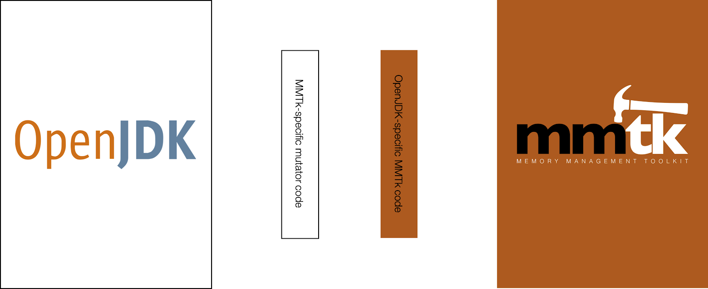

# Overview of MMTk’s Approach to Portability

MMTk is designed from the outset to be both high performance and portable.
The core of MMTk is entirely runtime-neutral, and is written in Rust.
Runtimes that wish to use MMTk may be written in any language so long as they have a means to call into MMTk’s API, which presents itself as a shared library.  

MMTk uses the concept of *bindings* to create high performance impedance matching between runtimes and MMTk.

MMTk’s approach to portability follows these principles:

 1. The MMTk core must remain entirely runtime-agnostic and free of any runtime-specific code.
 2. The runtime’s code base should be entirely garbage-collector agnostic and free of any MMTk-specific code.
 3. The semantics of all MMTk functionality is strictly defined within the MMTk core.

Those principles have the following important implications:

 - Each port of a runtime is supported by a binding that has two components: one which is a logical extension of the runtime, written in the same language as the runtime, but which is MMTk-specific, and one which is a logical extension of MMTk, written in Rust, but which is runtime-specific (see diagram below).
 - A fully-correct but non-performant port will simply implement calls from the runtime to MMTk (to allocate an object, for example), and from MMTk to the runtime (to enumerate pointers, for example).
 - A performant port will likely replicate and lift MMTk functionality into the runtime portion of the port, and conversely replicate runtime functionality in Rust for performant access by MMTk.

The diagram above illustrates a port of MMTk to OpenJDK with the binding in the center.
The code coloured brown is logically part of MMTk and is written in Rust.
The code coloured white is logically part of OpenJDK and is written in C++.
The rightmost box is entirely free of any OpenJDK-specific code.
The leftmost box should be entirely free of any MMTk-specific code.

> Note: we do currently maintain a fork of OpenJDK which includes some necessary changes to their code base, but this is not MMTk-specific and ideally this will be upstreamed.  Our port to V8 is a cleaner example, where we’ve managed to work closely with the V8 team to upstream all of the refactoring of the V8 code base that was necessary for it to support a third party heap.

We structure the code into three repos. Taking the example of the OpenJDK port, the three repos are: the [MMTk core](https://github.com/mmtk/mmtk-core), the [binding repo](https://github.com/mmtk/mmtk-openjdk) containing both parts of the binding, and the OpenJDK repo, which is currently [a fork](https://github.com/mmtk/openjdk) we maintain.