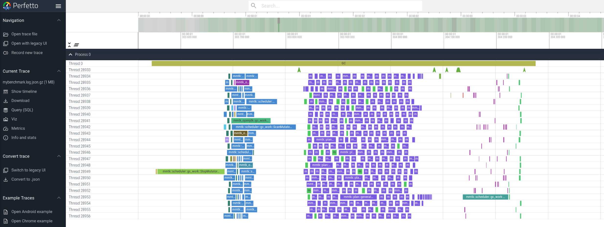

# MMTk GC visualization

This directory contains tools for visualizing the execution time of each work packet on a timeline. 

## Before Running

Before running, you should make sure the [bpftrace] command line utility is installed.

[bpftrace]: https://github.com/iovisor/bpftrace

## Capture a log

Run the `./capture.py` script to capture a log.

In this example, we use the OpenJDK binding to run the `lusearch` benchmark in the DaCapo Benchmark
Suite.

Run the following command with a **normal** user (*not* as `root` or using `sudo`):

```shell
./capture.py -e 50 -m /path/to/libmmtk_openjdk.so
```

`-e 50` means we only capture one GC in every 50 GCs because otherwise it will have to print too
much log.  (Note: Printing in bpftrace is done via a fixed-size user/kernel space buffer, therefore
excessive printing will overrun the buffer and cause events to be dropped.  The `-e` option helps
reducing the volume of log, thereby reducing the likelihood of buffer overrun and the time for
post-processing.  If one single GC still produces too much log and overruns the buffer, the user
should consider setting the `BPFTRACE_PERF_RB_PAGES` environment variable.  See the man page of
`bpftrace`.)

Replace `/path/to/libmmtk_openjdk.so` with the actual path to the `.so` that contains MMTk and its
binding.

Run the command and it will prompt you for root password because the script internally invokes
`sudo` to run `bpftrace`.  If the specified path to the `.so` is correct, it should print something
like:

```
Attaching 48 probes...
```

Then open another terminal, and run OpenJDK with MMTk.

```shell
/path/to/openjdk/build/linux-x86_64-normal-server-release/images/jdk/bin/java -XX:+UseThirdPartyHeap -Xm{s,x}100M -jar dacapo-23.11-chopin.jar lusearch
```

You should see logs showing in the terminal that runs `./capture.py`, like this:

```
...
WORK,E,23151,19072307551777,140188748267562
WORK,B,23162,19072307551916,140188748272882,143
WORK,E,23160,19072307551959,140188748279315
WORK,B,23150,19072307552199,140188748259188,42
WORK,B,23151,19072307552801,140188748259188,42
WORK,E,23150,19072307553295,140188748259188
WORK,B,23160,19072307553315,140188748259188,42
WORK,E,23151,19072307553701,140188748259188
WORK,E,23160,19072307554493,140188748259188
WORK,E,23156,19072307554636,140188748272882
WORK,B,23151,19072307554917,140188748272882,143
WORK,B,23150,19072307555142,140188748327402,406
WORK,E,23162,19072307555309,140188748272882
Lost 2027780 events
```

Then press CTRL+C in the terminal that runs `./capture.py`.  It should print additional logs and
then exit, like this:

```
...
@type_name[140188748468414]: mmtk::util::finalizable_processor::Finalization<mmtk::plan::gen
@type_name[140188748468841]: mmtk::util::finalizable_processor::Finalization<mmtk::scheduler
@type_name[140188748470271]: mmtk::util::finalizable_processor::Finalization<mmtk::scheduler
@type_name[140188748475639]: mmtk::plan::generational::gc_work::ProcessModBuf<mmtk::plan::ge
@type_name[140188748476795]: mmtk::plan::generational::gc_work::ProcessRegionModBuf<mmtk::pl
@type_name[140188748477674]: mmtk::plan::generational::gc_work::GenNurseryProcessEdges<mmtk_
```

This means things are working properly.  Now re-run `./capture.py` again, but pipe the STDOUT into a
file.

```
./capture.py -m /path/to/libmmtk_openjdk.so > mybenchmark.log
```

Type the root password if prompted.

Then run OpenJDK again.  This time, `./capture.py` should not print anything on the console.  When
the benchmark finishes, press CTRL-C to quit `./capture.py`.  You should see the log content in the
log file `mybenchmark.log`.

### `harness_begin` and `harness_end`

If your test harness calls `memory_manager::harness_begin` and `memory_manager::harness_end` before
and after the main part of the benchmark, you can add the command line option `-H` to `./capture.py`
so that it only records work packets between those two function calls, and will automatically exit
once `harness_end` is called (i.e. You don't need to manually press CTRL-C to quit `./capture.py`).

For the OpenJDK binding, it means you need to build the probes (<https://github.com/anupli/probes>)
and specify the callbacks properly according to your benchmark suite. For example,

```shell
/path/to/openjdk/build/linux-x86_64-normal-server-release/images/jdk/bin/java \
    -XX:+UseThirdPartyHeap \
    -Xm{s,x}100M \
    -Djava.library.path=/path/to/probes/out \
    -Dprobes=RustMMTk
    -cp /path/to/probes/out/probes.jar:/path/to/dacapo-23.11-chopin.jar \
    Harness -c probe.DacapoChopinCallback lusearch
```

## Post-processing the log for visualization

Then run `./visualize.py`.

```shell
./visualize.py mybenchmark.log
```

It will produce a file named `mybenchmark.log.json.gz`.

Then open a browser and visit Perfetto UI (<https://www.ui.perfetto.dev/>), click "Open trace file"
on the left, and choose the `mybenchmark.log.json.gz` file just produced.  It will process the log
in your browser and show a timeline.  Zoom in to one GC, and you should see the timeline for the GC,
like this:



## Known issues

### "(unknonwn:xxxx)" work packet names

When `bpftrace` reads the work packet names at the `work` USDT trace points, it sometimes sees the
string contents are all '\0'.  It is likely a result of lazy mmap.  The packet name is obtained by
`std::any::type_name` which is currently implemented using debug information.  It is likely that the
string contents are not mmapped at the time when `bpftrace` reads it from outside the process.

The `visualize.py` script uses the place-holder `(unknown:xxxx)` for such strings, where `xxxx` is
the addresses of the strings.

**Enable the `bpftrace_workaround` feature** of `mmtk-core` to work around this problem.  It forces
a load from the packet name before the trace point to ensure the string is mapped.  It adds a tiny
overhead, so it is not enabled by default.

See: https://github.com/mmtk/mmtk-core/issues/1020

<!--
vim: ts=4 sw=4 sts=4 et tw=100
-->
