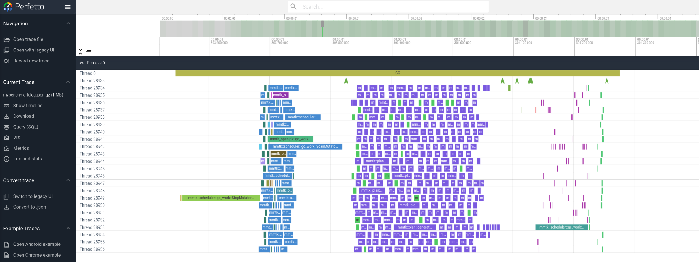

# MMTk GC visualization

This directory contains tools for visualizing the execution time of each work packet on a timeline.

## Before Running

Before running, you should make sure the [bpftrace] command line utility is installed.  You also
need Python 3.10 or later.

[bpftrace]: https://github.com/iovisor/bpftrace

## Capture a log

Run the `./capture.py` script to capture a log.

In this example, we use the OpenJDK binding to run the `lusearch` benchmark in the DaCapo Benchmark
Suite.

Run the following command with a **normal** user (*not* as `root` or using `sudo`):

```shell
./capture.py -e 47 -m /path/to/libmmtk_openjdk.so --no-root-nodes
```

`-e 47` means we only capture one GC in every 47 GCs because otherwise it will have to print too
much log.  (Note: Printing in bpftrace is done via a fixed-size user/kernel space buffer, therefore
excessive printing will overrun the buffer and cause events to be dropped.  The `-e` option helps
reducing the volume of log, thereby reducing the likelihood of buffer overrun and the time for
post-processing.  If one single GC still produces too much log and overruns the buffer, the user
should consider setting the `BPFTRACE_PERF_RB_PAGES` environment variable.  See the man page of
`bpftrace`.)  We choose a large prime number, such as 47, because some GCs may exhibit periodic
behaviors under certain workloads.  For example, generational GCs may alternate between nursery and
full-heap GC, making every odd GC a nursey GC, and every even GC a full-heap GC.  If we capture
every 50th GC, we will only observe even or odd GCs because 50 is an even number, and it will give
us an illusion of "all GCs are nursery GC" or "all GCs are full-heap GC".  This is an instance of
[aliasing effect].

[aliasing effect]: https://en.wikipedia.org/wiki/Aliasing

`--no-root-nodes` skips the `process_root_nodes` USDT which does not exist in `libmmtk_openjdk.so`.

Replace `/path/to/libmmtk_openjdk.so` with the actual path to the `.so` that contains MMTk and its
binding.

Run the command and it will prompt you for root password because the script internally invokes
`sudo` to run `bpftrace`.  If the specified path to the `.so` is correct, it should print something
like:

```
...
Attached 26 probes
====MMTK:CUT_HERE====
```

Then open another terminal, and run OpenJDK with MMTk.

```shell
/path/to/openjdk/build/linux-x86_64-normal-server-release/images/jdk/bin/java -XX:+UseThirdPartyHeap -Xm{s,x}100M -jar dacapo-23.11-MR2-chopin.jar lusearch
```

You should see logs showing in the terminal that runs `./capture.py`, like this:

```
gc_requested,i,115708,41346432406164
GC,B,115715,41346432462341
add_schedule_collection_packet,i,115715,41346432468032
WORK,B,115715,41346432479346,139898594718525,44
gen_full_heap,meta,115715,41346432489359,0
WORK,E,115715,41346432495607,139898594718525
WORK,B,115715,41346432497946,139898594597858,139
WORK,E,115715,41346432980636,139898594597858
WORK,B,115735,41346432982788,139898594600309,143
WORK,B,115715,41346432987786,139898594600309,143
WORK,B,115719,41346432987930,139898594590104,134
roots,meta,115735,41346432990728,0,2
WORK,E,115735,41346432993943,139898594600309
roots,meta,115715,41346432994917,0,2
WORK,B,115735,41346432994988,139898594600309,143
WORK,E,115715,41346432997876,139898594600309
...
WORK,E,115718,41348748729880,139898594642010
WORK,E,115737,41348748730014,139898594642010
BUCKET_OPEN,i,115718,41348748734550,18
plan_end_of_gc,B,115718,41348748735895
plan_end_of_gc,E,115718,41348748737804
GC,E,115718,41348748739984
gc_requested,i,115770,41348751350234
GC,B,115731,41348751375660
add_schedule_collection_packet,i,115731,41348751379012
gen_full_heap,meta,115731,41348751386384,0
GC,E,115720,41348752182137
gc_requested,i,115776,41348755704518
GC,B,115725,41348755720047
add_schedule_collection_packet,i,115725,41348755722343
gen_full_heap,meta,115725,41348755726909,0
GC,E,115734,41348756510361
gc_requested,i,115776,41348761478421
GC,B,115720,41348761493600
add_schedule_collection_packet,i,115720,41348761497245
gen_full_heap,meta,115720,41348761504991,0
GC,E,115734,41348762194242
gc_requested,i,115783,41348768675807
GC,B,115722,41348768696679
add_schedule_collection_packet,i,115722,41348768700538
gen_full_heap,meta,115722,41348768709878,0
GC,E,115737,41348769408588
```

Then press CTRL+C in the terminal that runs `./capture.py`.  It should print additional logs and
then exit, like this:

```
...
@type_name[139898594718525]: mmtk::scheduler::gc_work::ScheduleCollectio
@type_name[139898594718727]: mmtk::scheduler::gc_work::VMProcessWeakRefs<mmtk::plan::tracing::PlanTrace<mmtk::plan::generational::immix::global::GenImmix<mmtk_openjdk::OpenJDK<true>>, 0>
@type_name[139898594720646]: mmtk::scheduler::gc_work::VMProcessWeakRefs<mmtk::plan::generational::gc_work::GenNurseryTrace<mmtk_openjdk::OpenJDK<true>, mmtk::plan::generational::immix::global::GenImmix<mmtk_openjdk::OpenJDK<true>>, u8::MAX>
@type_name[139898594723178]: mmtk::util::reference_processor::RescanReferences<mmtk_openjdk::OpenJDK<true>
@type_name[139898594724717]: mmtk_openjdk::gc_work::FixRelocation
@type_name[139898594731250]: mmtk::scheduler::gc_work::ProcessSlots<mmtk::plan::tracing::PlanTrace<mmtk::plan::generational::immix::global::GenImmix<mmtk_openjdk::OpenJDK<true>>, 0>
@type_name[139898594731554]: mmtk::scheduler::gc_work::ProcessSlots<mmtk::plan::generational::gc_work::GenNurseryTrace<mmtk_openjdk::OpenJDK<true>, mmtk::plan::generational::immix::global::GenImmix<mmtk_openjdk::OpenJDK<true>>, u8::MAX>
```

This means things are working properly.  Now re-run `./capture.py` again, but pipe the STDOUT into a
file.

```
./capture.py -e 47 -m /path/to/libmmtk_openjdk.so --no-root-nodes > mybenchmark.log
```

Type the root password if prompted.

Then run OpenJDK again.  This time, `./capture.py` should not print anything on the console.  When
the benchmark finishes, press CTRL-C to quit `./capture.py`.  You should see the log content in the
log file `mybenchmark.log`.

### `harness_begin` and `harness_end`

If your test harness calls `memory_manager::harness_begin` and `memory_manager::harness_end` before
and after the main part of the benchmark, you can add the command line option `-H` to `./capture.py`
so that it only records work packets between those two function calls, and will automatically exit
once `harness_end` is called (i.e. You don't need to manually press CTRL-C to quit `./capture.py`).

For the OpenJDK binding, it means you need to build the probes (<https://github.com/anupli/probes>)
and specify the callbacks properly according to your benchmark suite. For example,

```shell
/path/to/openjdk/build/linux-x86_64-normal-server-release/images/jdk/bin/java \
    -XX:+UseThirdPartyHeap \
    -Xm{s,x}100M \
    -Djava.library.path=/path/to/probes/out \
    -Dprobes=RustMMTk
    -cp /path/to/probes/out/probes.jar:/path/to/dacapo-23.11-MR2-chopin.jar \
    Harness -c probe.DacapoChopinCallback lusearch
```

## Post-processing the log for visualization

Then run `./visualize.py`.

```shell
./visualize.py mybenchmark.log
```

It will produce a file named `mybenchmark.log.json.gz`.

Then open a browser and visit Perfetto UI (<https://www.ui.perfetto.dev/>), click "Open trace file"
on the left, and choose the `mybenchmark.log.json.gz` file just produced.  It will process the log
in your browser and show a timeline.  Zoom in to one GC, and you should see the timeline for the GC,
like this:



## Extending the timeline tool

VM binding developers can insert USDT trace points, too, and our scripts `capture.py` and
`visualize.py` provides mechanisms for extension.  Read [EXTENSION.md](EXTENSION.md) for more
details.

## Known issues

### "(unknonwn:xxxx)" work packet names

When `bpftrace` reads the work packet names at the `work` USDT trace points, it sometimes sees the
string contents are all '\0'.  It is likely a result of lazy mmap.  The packet name is obtained by
`std::any::type_name` which is currently implemented using debug information.  It is likely that the
string contents are not mmapped at the time when `bpftrace` reads it from outside the process.

The `visualize.py` script uses the place-holder `(unknown:xxxx)` for such strings, where `xxxx` is
the addresses of the strings.

**Enable the `bpftrace_workaround` feature** of `mmtk-core` to work around this problem.  It forces
a load from the packet name before the trace point to ensure the string is mapped.  It adds a tiny
overhead, so it is not enabled by default.

See: https://github.com/mmtk/mmtk-core/issues/1020

<!--
vim: ts=4 sw=4 sts=4 et tw=100
-->
